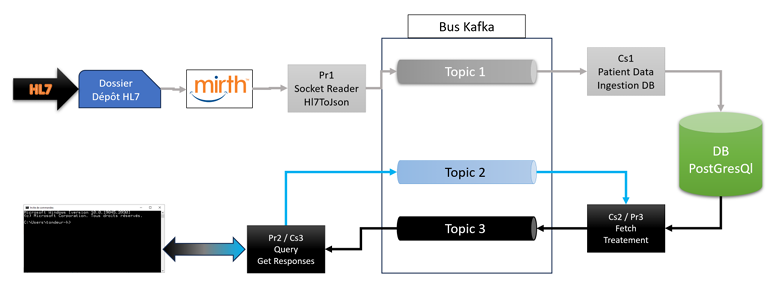

# Projet Intergiciel - FISA 4 INFO - INSA Hdf
 

|   |           |  |
| :--------------: | :--------------: | :--------------: |
| Alaaeddin ALMAJJO | Ayman DOULKOM        | Pape THIAM  |
| 22001993  | 00000000           | 22009010  |
| [@aladinMJ](https://github.com/aladinMJ) | [@ayman-h226](https://github.com/ayman-h226)        | [@mayel15](https://github.com/mayel15)  |
| alaaeddin.almajjo@uphf.fr  | ayman.doulkom@uphf.fr           | papemayeldiagne.thiam@uphf.fr  |

# Technos utilisées

     </a> 

# Description du projet 

Ce projet consiste à développer différentes applications, utilisant les API Kafka-Client et/ou le Framework SpringBoot, pour la manipulation de fichiers HL7 de type ADT. L'objectif est de lire, parser et formater ces fichiers en format JSON, puis de les transporter via un topic Kafka vers une base de données PostgreSQL.

L'architecture comprend plusieurs modules, notamment des producteurs et des consommateurs Kafka, ainsi qu'une application console permettant de requêter la base de données. Les échanges se font via des flux d'événements Kafka.

Les principales fonctionnalités incluent:
- la lecture des fichiers HL7, leur conversion en JSON
- leur envoi via Kafka, l'intégration dans la base de données
- la possibilité de requêter la base de données via une console texte des commandes prédéfinies.

Les livrables comprennent :
- le code source des différents modules
- le paramétrage du service Kafka
- le docker-compose `docker-compose.yml` adapté
- le script sh `create-topics.sh` pour la creation des topics Kafka 
- le script SQL `database.sql` pour la création de la base de données
- le `rapport` de projet répondant aux questions posées
- et ce `README.md` contenant les informations sur le projet et l'équipe de développement

# Console text 

## Run

- Cloner le projet avec `git clone https://github.com/mayel15/projet-intergiciel.git`
- Exécuter à la racine du projet `docker-compose up -d` qui va permettre de démarrer mirth connect (au port `8444`) et une base de données postgresql version 16, la database est stockée en local, elle est accessible via le port `5435` en externe.
- Exécuter le script `database.sql` dans la base de données pour la création des tables. Décommenter la partie de peupleument de la satabase, si c'est pour travailler de manière indépendante des données de récupéreées depuis `mirth` 
- Ouvrir les deux sous projets (dossiers) séparément `consumer2-producer3` et `producer2-consumer3-cs`; et les lancer séparament
- La console text sera disponible au niveau du run du projet `producer2-consumer3-cs`
  
## Commandes disponibles
- `get_all_patients` : retourne tous les patients
- `get_patient_by_pid` : retourne l'identité complète d'un patient par son identifiant PID-3
- get_patient_by_name : retourne l'identité d'un patient par son nom
- `get_patient_stay_by_pid` : retourne les séjours d'un patient par son identifiant PID-3
- `get_patient_movements_by_sid` : retourne tous les mouvements d'un patient par le numéro de séjour
- `export` : exporte les données de la base de données en JSON dans un fichier
- `help` : affiche la liste des commandes et une explication comme ci-dessus
- `exit` : quitte la console

## Demo de la console text

